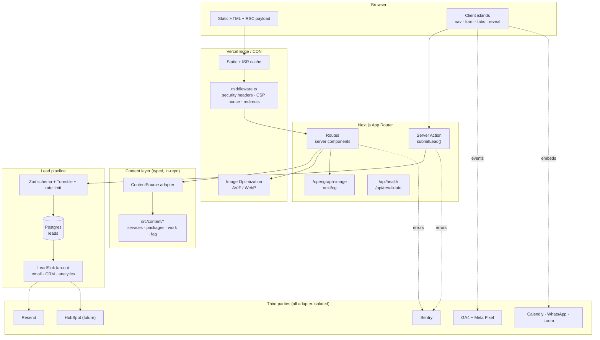

# 00 — System Design & Engineering Blueprint

> **Product:** Dev2Scale agency website · **Positioning:** Build. Automate. Grow.
> **Goal:** the visual quality and conversion power of a premium agency site, on an
> engineering foundation that stays clean, testable, secure and extensible for years.

---

## 1. Executive summary

Dev2Scale is a technology + growth agency selling three connected capabilities: **Build**
(websites, ecommerce, digital infrastructure), **Automate** (AI systems, agents, workflows),
**Grow** (performance marketing, acquisition, conversion). The website's job is to make those
read as *one system*, prove it with real work, publish real pricing, and make starting a
conversation trivial.

The engineering shape that serves that:

**A statically-rendered, token-driven, multi-route Next.js marketing site with a thin,
well-guarded server surface for exactly one stateful thing — leads.**

Everything else — content, pricing, case studies, navigation, SEO metadata, sitemap —
is typed data in the repository behind adapter interfaces, so a CMS, a CRM, or an
analytics vendor can be introduced later without touching a single component.

The three commitments that shape every decision below:

1. **Proof over claims.** The architecture has a `verified` flag on every metric and a
   `status` field on every case study. Unverified content renders an honest empty state.
   It is structurally difficult to ship a fabricated number. (PRD §47, non-negotiable.)
2. **Premium over flashy.** Quality comes from typography, spacing, composition, material
   and restraint — enforced by a token system and a single motion vocabulary, not by
   letting each section invent its own animation.
3. **Fast despite the visuals.** Glass, glow and gradient are CSS, not images or canvas.
   Motion is opt-in per component and off under `prefers-reduced-motion`. Performance
   budgets fail the build, not a code review.

---

## 2. Architecture at a glance



**Reading the diagram:** the wide path (left to right) is static and cached — a visitor
reading the site never touches application code. The narrow path (`submitLead`) is the only
place user input enters the system, so it is the only place that needs validation, rate
limiting, spam protection and durable storage. That asymmetry is the whole security and
performance strategy in one sentence.

---

## 3. The 25 deliverables and where each one lives

| # | Deliverable | Document |
| --- | --- | --- |
| 1 | System architecture | [02](./02-system-architecture.md) |
| 2 | Technology decisions | [03](./03-technology-stack.md) |
| 3 | Architecture diagram | §2 above, plus [02 §1](./02-system-architecture.md) |
| 4 | Frontend architecture | [04](./04-frontend-architecture.md) |
| 5 | Backend architecture | [02 §4](./02-system-architecture.md) |
| 6 | Data / integration architecture | [02 §5](./02-system-architecture.md), [14 §3](./14-repository-structure.md) |
| 7 | Design system | [05](./05-design-system.md) |
| 8 | Animation system | [06](./06-motion-system.md) |
| 9 | Responsive strategy | [07](./07-responsive-strategy.md) |
| 10 | Performance strategy | [08](./08-performance.md) |
| 11 | SEO strategy | [09](./09-seo.md) |
| 12 | Security strategy | [11](./11-security.md) |
| 13 | Analytics / observability | [10](./10-conversion-and-analytics.md) |
| 14 | Git / GitHub workflow | [12 §1](./12-engineering-workflow.md) |
| 15 | CI/CD architecture | [12 §2](./12-engineering-workflow.md) |
| 16 | Environment strategy | [12 §3](./12-engineering-workflow.md) |
| 17 | Deployment architecture | [12 §4](./12-engineering-workflow.md) |
| 18 | Testing strategy | [13 §1](./13-testing-and-quality-gates.md) |
| 19 | Production quality gates | [13 §3](./13-testing-and-quality-gates.md) |
| 20 | Repository structure | [14 §1](./14-repository-structure.md) |
| 21 | Documentation structure | [14 §4](./14-repository-structure.md) |
| 22 | Developer rules | [13 §2](./13-testing-and-quality-gates.md) |
| 23 | Definition of Done | [13 §4](./13-testing-and-quality-gates.md) |
| 24 | Production deployment checklist | [13 §5](./13-testing-and-quality-gates.md) |
| 25 | Future scalability & integrations | [14 §3](./14-repository-structure.md) |
| — | Reference-site analysis | [01](./01-design-benchmark.md) |

---

## 4. The theme, in one page

Derived from `Dev2Scale@Assets/` — not invented. Full specification in [05](./05-design-system.md).

The logo is the design system. Read left to right, the mark is an orange `<`, three rising
bars that warm from orange through gold, and a blue `>`. That is **Build → Automate → Grow**
already drawn. So:

| Pillar | Colour | Source |
| --- | --- | --- |
| **Build** | Ember `#F56935` | left chevron of the logo mark |
| **Automate** | Gold `#FFC839` | the rising centre bars |
| **Grow** | Signal blue `#0E5BC5` → Azure `#2FB1FF` | right chevron + the `2scale` wordmark |

The brand hero asset (`file_0000000068247208867ac3f2cff8504e.png`) settles the canvas
question: a near-black navy base (`#04060E`), a deep blue radial bloom behind the subject,
an ember bleed from the lower-left corner, and floating rounded-square glass tiles with
blue-lit edges. That is the site: **dark premium base, one blue accent system, ember used
sparingly, glass as a material and not a mood.**

```
CANVAS        #04060E ink        alternating #070B16 for section rhythm
SURFACE       rgba(255,255,255,.045) + 1px rgba(255,255,255,.09) + blur(16px)
ACCENT        signal #0E5BC5 (action) · azure #2FB1FF (link/highlight on dark)
WARM ACCENT   ember #F56935 · gold #FFC839  — ≤5% of any viewport
TEXT          #F7F9FC primary · #A8B3C7 secondary · #6B778F muted
RADIUS        20px cards/tiles · 12px buttons · pill only for chips
MOTION        16–24px rise, 400–600ms, cubic-bezier(.16,1,.3,1), once, never on LCP
```

**Hard rules that fall out of it:** signal blue is never body text on dark (fails contrast —
use azure). Glass never nests. Ember never gradients into blue. No section is allowed more
than one gradient.

---

## 5. Decision log

Each row is a commitment with a reason. Full reasoning, alternatives and integration notes
are in [03](./03-technology-stack.md) — this table is the summary a reviewer can scan.

| Area | Decision | Primary reason |
| --- | --- | --- |
| Framework | Next.js App Router, TypeScript strict | Server components keep JS off the critical path; first-class SEO and metadata; the team already knows it (PRD §49 says evolve, don't replace) |
| Rendering | Static by default, ISR only where content becomes dynamic | A marketing site has no per-user state on the read path; static is the fastest and cheapest correct answer |
| Styling | Tailwind CSS + CSS custom properties as the token source of truth | Tokens in one place, utilities at the call site, zero runtime cost |
| Components | Hand-built primitives, no UI library | 20 primitives with a bespoke look; a library would be fought more than used |
| Motion | Framer Motion for orchestration, CSS for everything simple | Scroll/stagger orchestration is genuinely hard in CSS; hovers are not |
| Content | Typed TS modules behind a `ContentSource` adapter | Type safety + zero infra now; Sanity later without touching components |
| Routing | Multi-route (`/services/*`, `/work/*`, `/pricing`, …) | PRD §6.3/§51: short pages beat one giant homepage; also gives each buyer journey a landing surface |
| Forms | Server Action + Zod, progressive-enhancement friendly | Validation shared client/server from one schema; no client JS required to submit |
| Lead storage | Serverless Postgres (`leads` table) written *before* notification | A dropped email must never mean a lost lead |
| Integrations | `LeadSink` / `ContentSource` / `Analytics` adapter interfaces | PRD §19 and the brief both require swapping a provider without a rewrite |
| Email | Resend | Transactional-only need, DX, deliverability, no bloat |
| Spam | Cloudflare Turnstile + honeypot + Upstash rate limit | Layered, no CAPTCHA friction on a conversion form |
| Analytics | GA4 + Meta Pixel behind a typed `track()` façade, consent-gated | PRD §45 requires both; the façade prevents ad-hoc `dataLayer` pushes |
| Errors | Sentry with release tagging + source maps | Deploy-attributable stack traces are the only fast way to triage prod |
| Hosting | Vercel | Preview deploy per PR, instant rollback, first-party Next.js runtime |
| Testing | Vitest + Testing Library, Playwright (E2E + axe + visual), Lighthouse CI | Each layer catches a different class of regression; all run in CI |
| CI/CD | GitHub Actions: verify → preview → merge → deploy → smoke | No code reaches production without passing gates |
| Feature flags | Typed `flags.ts` from env / Edge Config | A marketing site needs kill-switches, not an experimentation platform |

### Deliberate non-decisions

Things we are consciously *not* building, so nobody adds them by reflex:

- **No authentication.** Nothing on the site is private. A client portal is P2 and gets its
  own subdomain and its own security review when it exists.
- **No headless CMS on day one.** Two people edit this content today. The adapter boundary
  is built now; the CMS is introduced when a non-developer needs to publish (see [14 §3](./14-repository-structure.md)).
- **No custom cursor, no page-transition curtain, no scroll-jacking.** All three trade
  measurable usability for a screenshot. Benchmarked in [01 §4](./01-design-benchmark.md).
- **No i18n framework.** Positioning is international but the site is English-only; the
  route/metadata architecture leaves room for `/[locale]` without a rewrite.
- **No GTM container.** Direct, consent-gated script loading is faster and auditable; GTM
  invites untracked third-party tags into a strict-CSP site.

---

## 6. Delivery plan

Sequenced so that every phase ends with something shippable, and the foundation work that
is expensive to retrofit happens first.

| Phase | Scope | Exit criteria |
| --- | --- | --- |
| **P0.1 Foundation** | Token retheme, `env.ts` validation, `middleware.ts` + CSP, route registry, metadata factory, Sentry, CI pipeline, test harness | `main` deploys green through all gates; Lighthouse ≥95 on a stub page |
| **P0.2 Conversion spine** | Lead Server Action, Postgres, Turnstile, rate limit, Resend, `/contact` + thank-you route, typed analytics events | A real submission lands in the DB, the inbox, and GA4 — verified end to end |
| **P0.3 Homepage** | Hero, trust strip, three pillars, problem, selected work, results, process, pricing snapshot, final CTA | Passes the PRD §62 five-second / thirty-second comprehension test on a 375px viewport |
| **P0.4 Core routes** | `/services` hub + 5 service pages, `/work` + Patna Fashion case study, `/pricing`, `/contact` | Every nav destination exists; no route without unique metadata and an H1 |
| **P1** | `/process`, `/about`, testimonial system, remaining case studies, OG image generation, visual-regression baseline | Full IA populated; proof sections carry real assets only |
| **P2** | CMS adapter swap, CRM adapter, richer AI demos, additional case studies | Non-developer publishing works; no component changes required |

**Asset blockers to resolve before P0.3** (identified while reading the assets):

- `public/logos/logo.svg` is **0 bytes**. The only logo sources available are raster
  (largest usable: 1983×793) and one PDF with an embedded 327×178 bitmap. The mark needs a
  vector redraw before it can sit in a sticky nav at 2× and 3×.
- No `public/og-image.png`, no `favicon.ico`. Both are generated in P0.1 from the tokens.
- The wordmark is set in **Etna Regular** (confirmed from the embedded font in
  `dev2scale.pdf`). It is a logo-only face; the site's display face is a separate,
  licensed-for-web decision documented in [05 §3](./05-design-system.md).
- Verified proof currently amounts to exactly one case study (Patna Fashion: ₹1,946.60 spend
  → 138 calls → ₹2L+ in 2 days, corroborated by the Ads Manager screenshot). Every other
  proof slot must render its empty state until real data arrives.

---

## 7. Open decisions needing sign-off

**D-1 — Dark-premium retheme (blocking P0.1).**
The current implementation is a light theme ("Bright & trustworthy": white canvas, royal
blue, soft shadows). Every brand asset supplied is dark — near-black navy, blue bloom, ember
corner bleed, glass tiles — and the PRD asks for glassmorphism, translucent surfaces, depth
and "dark premium backgrounds where appropriate" (§5.1, §53). Glass has no material meaning
on a white canvas, so the two directions are not combinable at the token level.

*Recommendation:* adopt the dark system in [05](./05-design-system.md). It costs a token-layer
rewrite plus a per-component contrast pass — roughly a day and a half — and it is far cheaper
now than after nine more sections exist. The token layer keeps a light-inverted band available
for high-density content (pricing tables, comparison grids) where a light surface genuinely
reads better.

*If the answer is no:* [05](./05-design-system.md) still applies unchanged for type, spacing,
radius, motion and component anatomy; only the colour/material section is replaced, and glass
is demoted from a material to a hairline-and-shadow treatment.

**D-2 — Display typeface.** Keep Plus Jakarta Sans (already self-hosted, geometrically close
to the Etna wordmark, zero added cost) or introduce an editorial serif for headlines, which is
the single biggest differentiator on the benchmark site. Recommendation and trade-off in
[05 §3](./05-design-system.md); recommendation is to keep the sans.

**D-3 — Next.js major version.** The repo is pinned to `next@14.2.5`. Recommendation is to
upgrade to the current stable major during P0.1, while there is no feature work to conflict
with, and to move `framer-motion` to its React-19-compatible release at the same time.
Verify the current version with `npm view next version` before pinning — do not copy a
version number out of this document.
