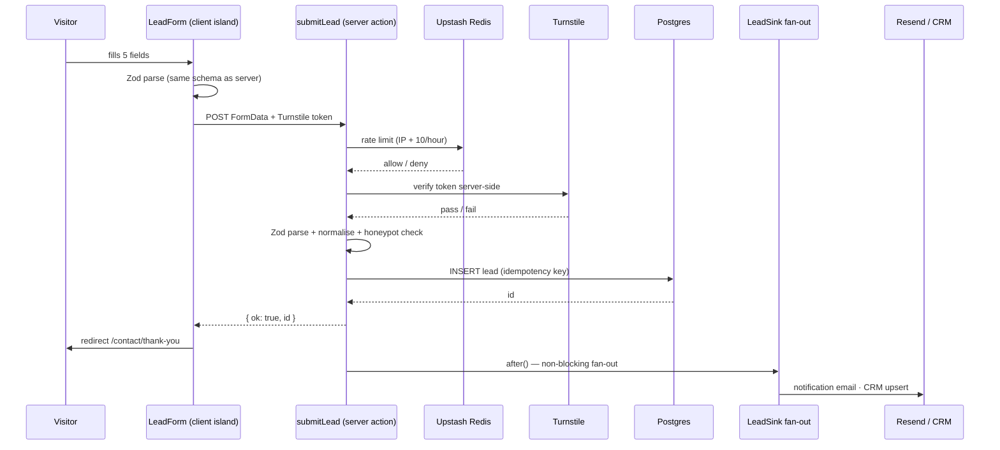

# 02 — System Architecture

The guiding principle: **the read path is static, the write path is narrow.** Everything a
visitor sees is pre-rendered and served from cache. Exactly one operation mutates state
(a lead submission), so exactly one place needs validation, abuse protection and durability.
Complexity is concentrated where it earns its keep instead of being spread evenly.

---

## 1. Layers

```mermaid
flowchart LR
    subgraph L1["1 · Presentation"]
        direction TB
        P1["Server components<br/>sections + primitives"]
        P2["Client islands<br/>nav · form · tabs · reveal · demos"]
    end
    subgraph L2["2 · Composition"]
        direction TB
        C1["Route registry<br/>src/config/routes.ts"]
        C2["Metadata factory"]
        C3["Section shell + design tokens"]
    end
    subgraph L3["3 · Domain / content"]
        direction TB
        D1["Typed content modules"]
        D2["Zod-validated schemas"]
        D3["ContentSource adapter"]
    end
    subgraph L4["4 · Server"]
        direction TB
        S1["submitLead server action"]
        S2["Route handlers<br/>health · revalidate · og"]
        S3["middleware<br/>headers · CSP · redirects"]
    end
    subgraph L5["5 · Integration"]
        direction TB
        I1["LeadSink[]"]
        I2["Mailer"]
        I3["Analytics"]
        I4["Logger + Sentry"]
    end
    subgraph L6["6 · Platform"]
        direction TB
        F1["Vercel edge + CDN"]
        F2["Postgres"]
        F3["Upstash Redis"]
    end
    L1 --> L2 --> L3
    L1 --> L4 --> L5 --> L6
    L3 --> L2
```



**The rule that keeps this honest: dependencies point one way, downward.** A content module
never imports a component. A component never imports the database client. An integration
never imports a route. Any import that goes back up the stack is a review blocker — it is
the first symptom of the architecture rotting.

| Layer | Owns | Must never |
| --- | --- | --- |
| 1 Presentation | Markup, tokens, motion, a11y semantics | Contain copy, prices, or business rules |
| 2 Composition | Route table, metadata, section shell, layout | Fetch data or contain domain logic |
| 3 Domain/content | Content shape, validation, adapters | Know about React or the DOM |
| 4 Server | Input validation, orchestration, headers | Contain presentation or vendor SDK specifics |
| 5 Integration | Vendor SDK calls, retries, mapping | Be imported by a component directly |
| 6 Platform | Runtime, cache, storage | Be assumed available at build time |

---

## 2. Rendering strategy

| Route class | Strategy | Why |
| --- | --- | --- |
| `/`, `/services/*`, `/pricing`, `/process`, `/about`, `/contact`, `/privacy`, `/terms` | **Static (SSG)** at build | Content changes on deploy, not on request. Fastest possible TTFB and zero runtime cost. |
| `/work`, `/work/[slug]` | **Static + `generateStaticParams`** now; **ISR (`revalidate: 3600`)** the moment content moves to a CMS | Same content, but the CMS introduces an editing loop that shouldn't need a deploy. |
| `/opengraph-image` per route | Static at build via `next/og` | Branded social cards without a design round-trip; deterministic from tokens. |
| `/api/health` | Dynamic, no cache | Smoke tests need a truthful, uncached answer. |
| `/api/revalidate` | Dynamic, secret-protected | The CMS webhook target, added with the CMS. |
| `submitLead` | Server Action, Node runtime | Needs the Postgres driver and the Resend SDK. |

**Deliberately not used:** SSR for page content (nothing is per-request), client-side data
fetching for content (defeats SEO and adds a spinner where none is needed), and Edge runtime
for the lead action (the Postgres driver and email SDK belong on Node; edge saves ~30 ms on a
non-blocking POST and costs real compatibility risk).

---

## 3. Frontend architecture

Full detail in [04](./04-frontend-architecture.md). The architectural essentials:

- **Server components are the default.** `"use client"` is a justified exception, added only
  for state, effects, or Framer Motion — and pushed as far down the tree as possible so an
  interactive leaf never drags its parent section to the client.
- **Four component tiers**, and a component may only import from the tier below it:
  `app/` routes → `sections/` → `ui/` primitives → `lib/` + tokens.
- **One section shell.** `Section` owns background tone, container width, vertical rhythm,
  `scroll-mt` for the sticky nav, and the optional heading block. Hand-rolled `<section>`
  wrappers are a review blocker; they are how spacing systems die.
- **Content in, markup out.** A section component takes typed props or reads a content
  module. No section contains a price, a claim, or a client name inline.

---

## 4. Backend architecture

The backend is intentionally three files, not a service.

### 4.1 The lead pipeline



**Why this order matters.** Cheap rejections come first (rate limit before Turnstile before
validation before database). The database write happens **before** any notification and
before the response is returned — so a Resend outage degrades to "we have the lead but
haven't emailed you yet," never "the lead is gone." Notifications run in `after()` so the
visitor sees the thank-you page without waiting on a third party.

**Idempotency.** The client sends a `submissionId` (UUID generated on form mount). The DB has
a unique index on it. A double-click, a retry, or a flaky network produces one lead, not
three.

### 4.2 The `leads` table

```
leads
  id             uuid pk default gen_random_uuid()
  submission_id  uuid unique not null        -- idempotency
  name           text not null
  email          text                        -- one of email/phone required
  phone          text
  company        text
  interest       text not null               -- 'build' | 'automate' | 'grow' | 'not-sure'
  message        text
  budget_range   text
  source         jsonb not null              -- { path, referrer, utm_*, gclid, fbclid }
  consent        boolean not null
  status         text not null default 'new' -- new | contacted | qualified | won | lost | spam
  created_at     timestamptz not null default now()
  index (created_at desc), index (status)
```

`source` is `jsonb` on purpose: attribution parameters change with every ad platform, and a
schema migration is the wrong price to pay for a new UTM key.

**PII posture:** the table is the only place personal data lives. It is never logged, never
sent to analytics, never included in a Sentry event ([11 §6](./11-security.md)).

### 4.3 Route handlers

| Handler | Purpose | Notes |
| --- | --- | --- |
| `GET /api/health` | Returns `{ ok, commit, builtAt, checks: { db } }` | Post-deploy smoke test target; no secrets in the payload |
| `POST /api/revalidate` | CMS webhook → `revalidateTag()` | Added with the CMS; requires a shared secret + HMAC signature |

No other API routes. If a future feature seems to need one, check first whether a Server
Action does the job — an action is typed end to end and cannot be called by a stranger with
`curl` in the same way.

---

## 5. Data & integration architecture

### 5.1 Content

Content is **typed TypeScript modules** in `src/content/`, each validated by a Zod schema at
module load in development and at build time in CI. This gives us CMS-grade guarantees
(a case study cannot ship without a `status`; a metric cannot ship without `verified`) with
zero infrastructure and full type inference into components.

Access goes through one interface so the source can change:

```ts
// src/content/source.ts
export interface ContentSource {
  getCaseStudies(opts?: { status?: WorkStatus }): Promise<CaseStudy[]>;
  getCaseStudy(slug: string): Promise<CaseStudy | null>;
  getPackages(pillar?: PillarId): Promise<Package[]>;
  getServices(): Promise<Service[]>;
  getFaq(group: FaqGroup): Promise<FaqItem[]>;
}
```

`localContentSource` reads the TS modules today. `sanityContentSource` implements the same
interface later. Pages import `getContentSource()`, never a content module directly, so the
swap is one factory function and no component diff.

### 5.2 Integrations

Every third party sits behind an interface owned by us, so the vendor is a detail:

| Boundary | Interface | Today | Later |
| --- | --- | --- | --- |
| Lead delivery | `LeadSink.deliver(lead)` | `PostgresLeadSink`, `EmailLeadSink` | `HubSpotLeadSink`, `SlackLeadSink` |
| Email | `Mailer.send(msg)` | `ResendMailer` | Postmark / SES |
| Analytics | `Analytics.track(event)` | `Ga4Analytics`, `MetaPixelAnalytics` | PostHog, Segment |
| Content | `ContentSource` | `localContentSource` | `sanityContentSource` |
| Scheduling | Config value | Calendly URL in `siteConfig` | Cal.com — a URL change |
| Chat | Config value | WhatsApp deep link | Intercom/Crisp behind a `flags` toggle |

The `LeadSink[]` array is the important one: adding a CRM is *appending an implementation to
an array*, not editing the form, the action, or the database.

**Failure isolation.** The fan-out runs each sink independently with a timeout; one sink
failing is logged and reported to Sentry but never fails the submission or blocks another
sink. Vendor outages must not be visible to a visitor.

---

## 6. Caching strategy

| Layer | Policy | Reasoning |
| --- | --- | --- |
| Static assets (`/_next/static/*`) | `public, max-age=31536000, immutable` | Content-hashed filenames; safe forever |
| Optimised images | `public, max-age=31536000, immutable` | Same, plus Vercel's own image cache |
| HTML (static routes) | CDN-cached, invalidated on deploy | A deploy is the only way page content changes |
| HTML (ISR routes, post-CMS) | `s-maxage=3600, stale-while-revalidate=86400` | Editors see changes within the hour; visitors never wait for a rebuild |
| Fonts | `public, max-age=31536000, immutable`, self-hosted, preloaded | No third-party font hop; no FOIT |
| `/api/health` | `no-store` | Must reflect reality |
| Lead action | Never cached | Mutation |

**Cache invalidation, when the CMS lands:** tag-based. Content is fetched with
`{ next: { tags: ['case-study', slug] } }`; the webhook calls `revalidateTag`. Never
`revalidatePath('/')` as a blanket hammer — it discards the whole cache for one edit.

---

## 7. Configuration management

Configuration is layered, and each layer has exactly one job:

| File | Contains | Changes when |
| --- | --- | --- |
| `src/env.ts` | Zod-validated `process.env`, split `server` / `client` | Infrastructure changes |
| `src/config/site.ts` | Brand, URLs, contact channels, social | Business details change |
| `src/config/routes.ts` | The single route registry — nav, sitemap, breadcrumbs all derive from it | A page is added |
| `src/config/flags.ts` | Typed feature flags with defaults | A feature needs a kill-switch |
| `src/content/*` | Copy, pricing, proof | Marketing changes |
| Tailwind + `globals.css` | Design tokens | The design system changes |

**One route registry** is the load-bearing idea. A page added to `routes.ts` automatically
appears in the sitemap, gets breadcrumbs, and is available to the nav — the class of bug
where a new page is invisible to Google for three months simply cannot happen.

**Env validation fails fast.** `src/env.ts` throws at build and at server start when a
required variable is missing or malformed. A missing `RESEND_API_KEY` breaks the build in
CI, not the first lead of the month in production.

---

## 8. Database, auth, and other things we are not building yet

- **Database:** one table, one purpose. Serverless Postgres (Neon or Vercel Postgres) with
  Drizzle for typed queries and versioned migrations in `drizzle/`. Chosen over a
  spreadsheet or Airtable because leads are business-critical and deserve a schema,
  constraints and backups; chosen over Supabase/Firebase because we need none of the
  surrounding platform.
- **Authentication:** none. Nothing is gated. When a client portal exists (P2), it gets a
  separate route group, its own session strategy, and its own threat model — it does not
  retrofit onto a marketing site.
- **Search:** none. Fewer than 30 pages; the nav is the search. Revisit above ~50 case
  studies, at which point a static client-side index (FlexSearch over a generated JSON) is
  the cheap correct answer before any hosted search service.
- **Queues/background jobs:** `after()` covers non-blocking fan-out. A real queue is only
  justified if a sink needs retries across minutes; at that point, Upstash QStash — already
  in the stack via Redis.
